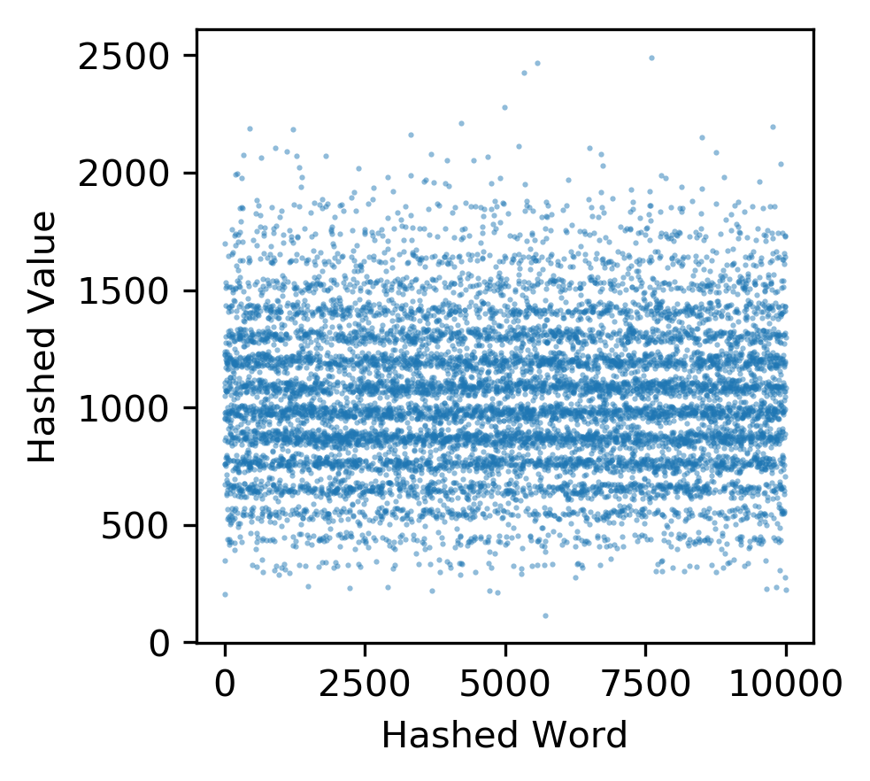

# Hash tables

This repository contains an implementation for ascii sum and rolling hash functions, and also linear probe and chained hash tables.

# Usage

To get a set of plots for the benchmarks, simple run the script `benchmarks.sh`.

# Installation

The `random, time, argparse, sys` packages are required.

# Results

We discuss some of the plots selected from the benchmark script.

This plot shows how the hashed value relates to a number of strings that have very similar characters. We can see that there is a very large amount of overlap between the words, and so for this kind of data ascii sum is a very poor collision strategy.

With this plot, we have a slightly better distribution than the last, but it is still easy to see lines of more common hashed values, indicating that certain collisions are still common, making ascii sum slighly better for randomized data but still having patterns in collisions.

Here, we see that when the rolling collision strategy is much better for non random input. While patterns can still be seen, it appears that for each hashed word iterated the hashed value changed, and there is a pretty spread spread of different hashed values throughout.

The plot here looks almost completely random, and it seems that the rolling collision strategy gives a good spread of hashed values to keep collisions to a minimum.

This plot shows the insersion time as the load factor increases for a hash table using a linear insertion method with an ascii hash function. It is clear that the insersion time increases as the load factor increases.

In contrast, this plot, which uses a rolling chained method, has an alomst constant insertion time independent of the load factor.
